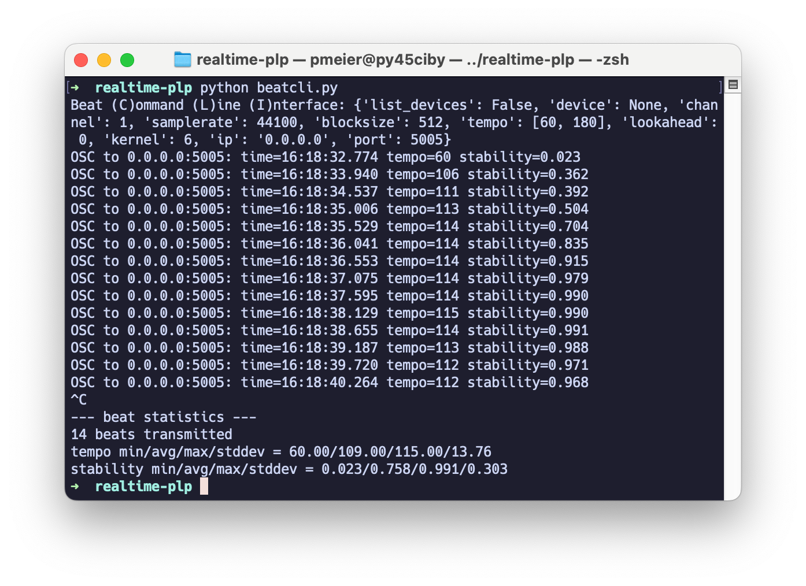
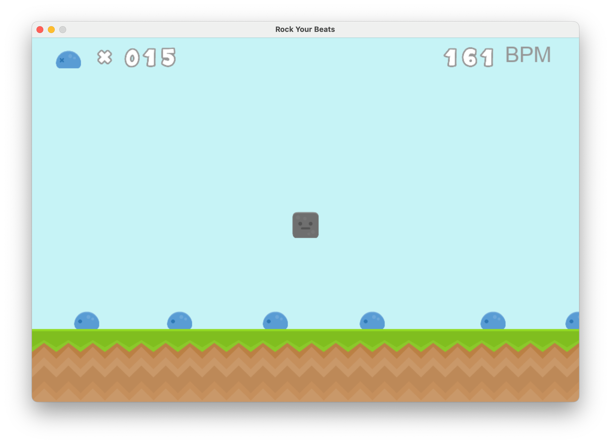
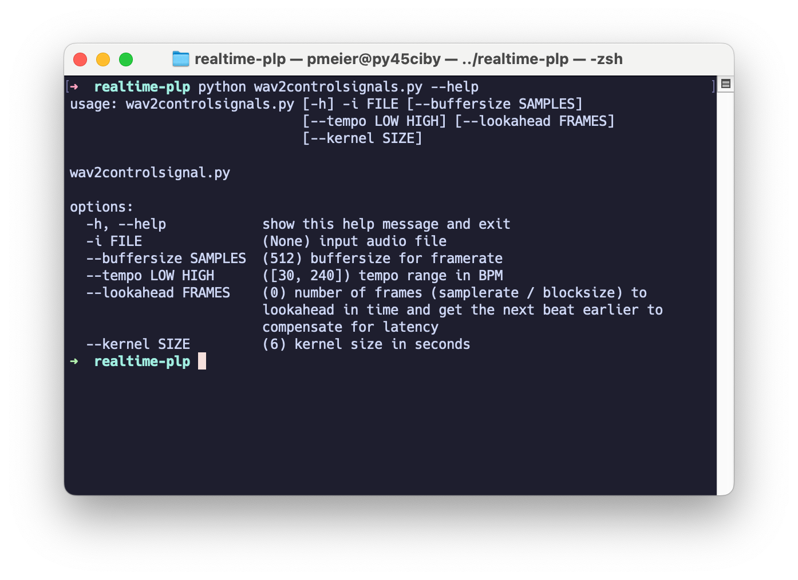

# Real-Time PLP

This repository contains **code examples** and **notebooks** that accompany the following paper:

1. :blue_book: Peter Meier, Ching-Yu Chiu, and Meinard Müller  
   [**A Real-Time Beat Tracking System with Zero Latency and Enhanced Controllability**](https://transactions.ismir.net/articles/10.5334/tismir.189)  
   Transactions of the International Society for Music Information Retrieval (TISMIR), 2024.

```bibtex
@article{MeierCM24_RealTimePLP_TISMIR,
    author    = {Peter Meier and Ching-Yu Chiu and Meinard M{\"u}ller},
    title     = {{A} Real-Time Beat Tracking System with Zero Latency and Enhanced Controllability},
    journal   = {Transactions of the International Society for Music Information Retrieval ({TISMIR})},
    year      = {2024},
    doi       = {10.5334/tismir.189}
}
```

2. :blue_book: Peter Meier, Simon Schwär, and Meinard Müller  
   [**A Real-Time Approach for Estimating Pulse Tracking Parameters for Beat-Synchronous Audio Effects**](https://github.com/IoSR-Surrey/DAFx24-Proceedings/raw/main/papers/DAFx24_paper_23.pdf)  
   In Proceedings of the International Conference on Digital Audio Effects (DAFx), 2024.

```bibtex
@inproceedings{MeierSM24_RealTimePulseParameters_DAFX,
    title       = {{A} Real-Time Approach for Estimating Pulse Tracking Parameters for Beat-Synchronous Audio Effects},
    author      = {Peter Meier and Simon Schw{\"a}r and Meinard M{\"u}ller},
    booktitle   = {Proceedings of the International Conference on Digital Audio Effects ({DAFx})},
    year        = {2024},
    address     = {Guildford, Surrey, UK}
}
```

# :computer: Install

This project requires **Python 3.12** to be installed on your system. Please ensure you have the correct version before proceeding with installation and execution of the code. You can download Python 3.12 from the official [Python website](https://www.python.org) or use a package manager suitable for your operating system.

To verify your Python version, run the following command in your terminal or command prompt:

```bash
python --version
```

## Install Python environment:

```shell
cd real_time_plp
python -m venv .venv
source .venv/bin/activate
pip install -r requirements.txt
```

**Note:** The Python package `sounddevice` requires [Portaudio](https://www.portaudio.com) installed on your system to capture audio from a microphone.

# :open_file_folder: Content

- `realtimeplp.py`: Single file real-time PLP implementation.
- `examples.ipynb`: Jupyter notebook with example plots using real-time PLP.
- `beatcli.py`: A real-time beat tracking dashboard for the terminal.
- `rockyourbeats.py`: An educational beat game prototype using real-time PLP.
- `wav2controlsignals.py`: Generate control signals output from WAV audio input.

## Start Jupyter Notebook `examples.ipynb`

Activate Python environment.

```shell
source .venv/bin/activate
```

Start `examples.ipynb` in JupyterLab.

```shell
juypter lab examples.ipynb
```

## Start `beatcli.py`



Activate Python environment.

```shell
source .venv/bin/activate
```

Getting help.

```shell
python beatcli.py --help
```

Show list of audio devices and exit.

```shell
python beatcli.py -l
```

Start the application listening to your system's default input sound device.

```shell
python beatcli.py
```

## Start the Game `rockyourbeats.py`



Activate Python environment.

```shell
source .venv/bin/activate
```

Start the game.

```shell
python rockyourbeats.py
```

The game listens to your system's default input sound device. You can check available sound devices with the command `python -m sounddevice`. To select a different input sound device or channel, modify the `DEVICE` or `CHANNEL` variables in the `rockyourbeats.py` file.

Move the **rock** to hit a **beat creature** by pressing the `space` bar on your keyboard.

### Game Assets

The game assets for `rockyourbeats.py` are from the "[Platformer Pack Redux](https://kenney.nl/assets/platformer-pack-redux)" by Kenney Vleugels and are licensed under [Creative Commons CC0](https://creativecommons.org/publicdomain/zero/1.0/). Thank you!

## Generate Control Signals with `wav2controlsignals.py`



Generate control signals from an audio file that are directly outputted as a WAV file, maintaining the same sampling rate as the original input file. This allows you to import both the control signals and your audio file into a DAW (Digital Audio Workstation) to control effect parameters within the DAW. An example of this technique is the "Parameter Modulation > Audio Control Signal (Sidechain)" feature in [Reaper](https://www.reaper.fm).

Activate Python environment.

```shell
source .venv/bin/activate
```

Getting help.

```shell
python wav2controlsignals.py --help
```

Generate control signals for input `FILE`.

```shell
python wav2controlsignals.py -i FILE
```

Generate control signals for input `FILE`, set specific tempo range, kernel size and lookahead values.

```shell
python wav2controlsignals.py -i FILE --tempo LOW HIGH --kernel SIZE --lookahead FRAMES
```

This script generates six control signals in the same directory as the input file, following this naming pattern:

```shell
inputfile.wav
inputfile_alpha_lfo.wav
inputfile_beta_conf.wav
inputfile_gamma_conf.wav
inputfile_gamma_lfo.wav
inputfile_beats.wav
inputfile_tempo.wav
```

All output files are resampled to match the sampling rate of the input file.

The file `inputfile_tempo.wav` provides the frame-based tempo values from the real-time beat tracker, with tempo values ranging from `[LOW, HIGH]` mapped to the range `[-1, 1]` within the waveform.

In `inputfile_beats.wav`, all values are set to zero by default, except for the samples at beat time positions, which are encoded with a value of 1.

## Acknowledgements

This work was funded by the Deutsche Forschungsgemeinschaft (DFG, German Research Foundation) under Grant No. 500643750 (MU 2686/15-1) and the National Science and Technology Council (NSTC), Taiwan, under Grant No. NSTC 112-2917-I-564-011. The [International Audio Laboratories Erlangen](https://audiolabs-erlangen.de) are a joint institution of the [Friedrich-Alexander-Universität Erlangen-Nürnberg (FAU)](https://www.fau.eu) and [Fraunhofer Institute for Integrated Circuits IIS](https://www.iis.fraunhofer.de/en.html).
